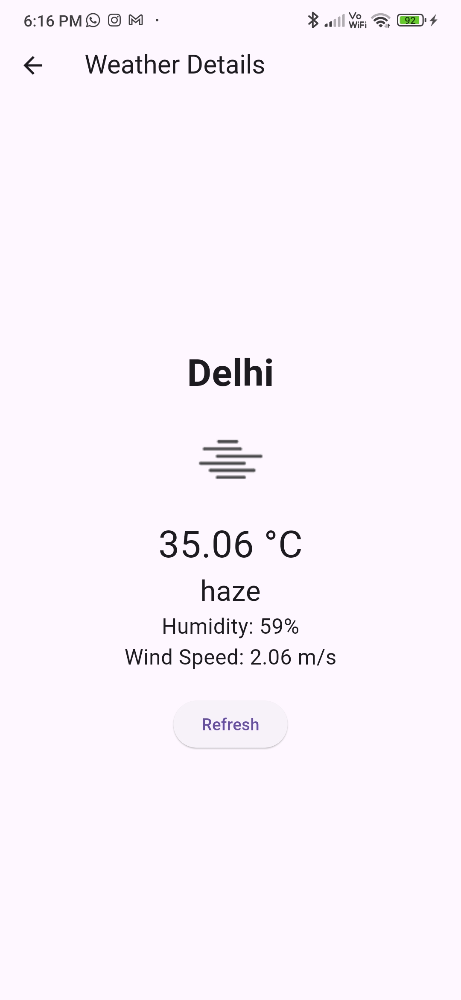

# Weather App

A simple weather application built with Flutter that fetches weather data using the OpenWeatherMap API.

## Features

- Home screen with a search bar to enter a city name
- Weather details screen to display the weather information:
  - City name
  - Current temperature (in Celsius)
  - Weather condition (e.g., cloudy, sunny, rainy)
  - An icon representing the weather condition
  - Humidity percentage
  - Wind speed
- Proper error handling for API requests with user-friendly error messages
- State management using `Provider`
- Basic responsive design for mobile and tablet devices
- "Refresh" button on the weather details screen to fetch updated weather data
- Data persistence to save the last searched city

## Screenshots





## Getting Started

### Prerequisites

- [Flutter](https://flutter.dev/docs/get-started/install) installed on your machine
- An API key from [OpenWeatherMap](https://openweathermap.org/api)

### Installation

1. Clone the repository:

   ```bash
   https://github.com/nikhilkum1r/weather_api.git
   ```

2. Install the required packages:

   ```bash
   flutter pub get
   ```

3. Replace `YOUR_API_KEY` in `lib/services/weather_api_service.dart` with your OpenWeatherMap API key.

### Running the App

1. Connect your device or start an emulator.
2. Run the app:
   ```bash
   flutter run
   ```

## Project Structure

```
lib
├── main.dart
├── screens
│   ├── home_screen.dart
│   └── weather_details_screen.dart
└── services
    └── weather_api_service.dart
```

## Code Overview

### `main.dart`

- Sets up the `ChangeNotifierProvider` for `WeatherApiService`
- Defines the `MyApp` widget that initializes the `MaterialApp`

### `services/weather_api_service.dart`

- Contains the `WeatherApiService` class that handles API requests to OpenWeatherMap and data persistence using `SharedPreferences`

### `screens/home_screen.dart`

- Home screen with a search bar and button to fetch weather data
- Displays a loading indicator while fetching data

### `screens/weather_details_screen.dart`

- Displays the weather details for the searched city
- Includes a "Refresh" button to fetch updated weather data

## Contributing

1. Fork the repository
2. Create your feature branch (`git checkout -b feature/AmazingFeature`)
3. Commit your changes (`git commit -m 'Add some AmazingFeature'`)
4. Push to the branch (`git push origin feature/AmazingFeature`)
5. Open a pull request

## License

This project is licensed under the MIT License - see the [LICENSE](LICENSE) file for details.

## Acknowledgements

- [OpenWeatherMap](https://openweathermap.org/) for the weather API
- [Flutter](https://flutter.dev/) for the awesome framework
